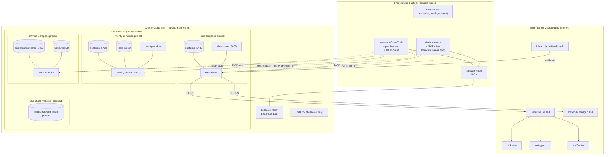
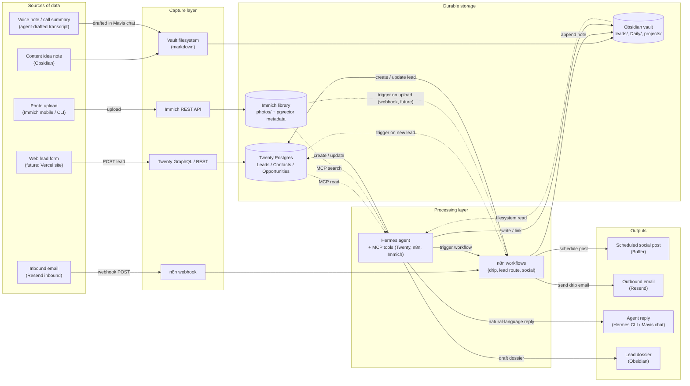
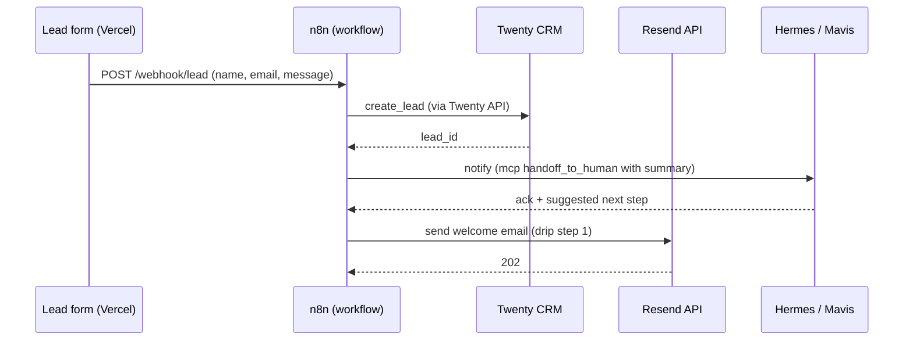

# Stack Config — MCP Wiring + Oracle VM + Block Storage

> Single source of truth for the weekend build. Companion to
> `docker-setups.md` (which is the per-container inventory).
> This file is the *wiring*: how the apps talk to each other, to the agent
> harness, and to Mavis in the Mavis app, and how the Oracle VM is laid out
> underneath them.

## What's running right now (2026-07-10)

| Service | Container / image | Port on Tailscale | State |
|---|---|---|---|
| Twenty CRM | `twentycrm/twenty:v2.20.0` (server + worker + postgres + redis) | `http://100.82.161.32:3020` | up, healthy |
| n8n | `docker.n8n.io/n8nio/n8n:2.29.10` (+ external runner + postgres) | `http://100.82.161.32:5678` | up |
| Immich | `ghcr.io/imagegenius/immich:3.0.1` (+ postgres-vectorchord + valkey) | `http://100.82.161.32:2283` | up, empty |
| Buffer | SaaS, account already configured | n/a | up |
| Tailscale | 100.x mesh | `100.82.161.32` (VM) ↔ Mac | up |
| Hermes VM | Oracle Cloud `VM.Standard.A1.Flex`, us-sanjose-1, aarch64 | public + Tailscale | up |

## What's not running yet (the build list)

1. **MCP servers** for Twenty, n8n, Immich — bring each into the protocol layer so the agent can touch them.
2. **Hermes (or OpenCode) MCP client config** — point the agent at the three MCP servers.
3. **Mavis daemon MCP client config** — same three servers, so Mavis in the Mavis app can also reach them.
4. **Buffer connector in n8n** — wire n8n workflows to Buffer's REST API.
5. **OCI Block Volume** — attach, mount, and move `/home/ubuntu/immich/photos` to it before importing real photos.

---

## 1. Architecture overview

### 1.1 Network diagram



**Security boundary (read this first):** every blue arrow that crosses into the VM terminates on the Tailscale IP `100.82.161.32`, never on `0.0.0.0`. The Mac is on the same Tailscale tailnet. External SaaS (Buffer, Resend) is reached over the public internet by n8n only.

### 1.2 Data flow diagram



**Key idea:** every app exposes a structured API. MCP turns those APIs into tools the agent can call. n8n owns the *time-based* and *event-based* glue (drips, webhooks, scheduling). The agent owns the *judgment-based* glue (drafting, routing, summarising).

---

## 2. Oracle VM setup

### 2.1 Current state

| Attribute | Value |
|---|---|
| VM name | `flucido-hermes-vm` |
| Cloud | Oracle Cloud Infrastructure (OCI) |
| Shape | `VM.Standard.A1.Flex` (Arm Ampere Altra, 2 OCPU / 12 GB) |
| Region / AD | `us-sanjose-1` / `REZA:US-SANJOSE-1:AD-1` |
| Public IP | (used only for SSH bastion if at all; primary access via Tailscale) |
| Tailscale IP | `100.82.161.32` |
| OS | Ubuntu 22.04 LTS (aarch64) |
| Docker | 29.6.0 |
| Compose | v5.2.0 |
| Root disk | 45 GB (29 used, 16 free) |
| RAM | 11 GB (5.2 used, 6.4 free) |
| Swap | **none — Day 1 TODO (§2.4)** |
| OCI block volume | **100 GB, attached via iSCSI (2026-07-10). OS-side setup pending — §2.2.** |

### 2.2 OCI Block Volume for Immich photos (iSCSI, 100 GB)

**Goal:** keep the photo library off the boot disk so it can grow without filling root, and so it can be snapshotted/backed-up independently. Photos are write-once-read-many, which is exactly what block volumes are good for.

**Status (2026-07-10):** volume is created and attached in OCI as **iSCSI** (not paravirtualized). The OS-side work below — discover, login, format, mount, move photos — is still owed.

**Size:** 100 GB. Sits well under the 200 GB Always Free cap, so it stays free. Grow by resizing, not by adding a second volume.

**Step 0 — verify what the OS already sees** (skip to Step 1 if nothing's there yet)

Some OCI-provided images ship with `open-iscsi` preinstalled and an `oci-iscsi` helper that auto-logs into attached volumes at boot. Worth a 30-second check before doing the manual install:

```bash
# Is the iSCSI device already visible?
lsblk
sudo ls -l /dev/disk/by-path/ 2>/dev/null | grep -i iscsi

# If you see /dev/sdX with no partitions and no filesystem, the device is logged in
# but unmounted — skip to Step 4 (format and mount).

# Is open-iscsi already installed?
dpkg -l open-iscsi 2>/dev/null | grep -q ^ii && echo "open-iscsi already installed" \
  || echo "open-iscsi needs installing"

# Are there existing iSCSI sessions?
sudo iscsiadm -m session 2>/dev/null
```

If `lsblk` shows the 100 GB device, you're at Step 4. If not, walk through Step 1 → Step 3 first.

**Step 1 — grab the iSCSI attachment details from OCI**

You need three values, all visible in the OCI console:

OCI Console → **Block Storage → Volumes → `immich-photos` → iSCSI section** (or the attachment's "iSCSI Commands & Information" panel):

| Value | Where to find it | Example |
|---|---|---|
| `IQN` | iSCSI section | `iqn.2015-12.com.oracleiaas:8b9e...-...-...` |
| `PORTAL_IP` | iSCSI section, "IP address" | `169.254.x.x` (link-local) |
| `PORTAL_PORT` | iSCSI section, "Port" | `3260` |

OCI also auto-generates a ready-to-paste `iscsiadm` command with these values filled in. **Copy it, but don't run it blind — you still need `open-iscsi` installed first.**

**Step 2 — install the iSCSI initiator and discover the target**

```bash
# Install (open-iscsi is the standard Linux iSCSI initiator)
sudo apt-get update
sudo apt-get install -y open-iscsi

# Enable + start the daemon
sudo systemctl enable iscsid
sudo systemctl start iscsid

# Verify the initiator is registered
sudo cat /etc/iscsi/initiatorname.iscsi

# Discover targets from the OCI portal (replace with your PORTAL_IP)
sudo iscsiadm -m discovery -t sendtargets -p <PORTAL_IP>
# Output will show the target IQN; that's the value of IQN above.
```

**Step 3 — log in to the target and make it auto-login on boot**

```bash
# Log in
sudo iscsiadm -m node -T <IQN> -p <PORTAL_IP>:<PORTAL_PORT> --login

# Set automatic login so the session survives reboots
sudo iscsiadm -m node -T <IQN> -p <PORTAL_IP>:<PORTAL_PORT> \
  --op update -n node.startup -v automatic

# Verify the device appeared
lsblk
# Expect to see a new disk (likely /dev/sdb) with no partitions and no filesystem.
sudo ls -l /dev/disk/by-path/ | grep iscsi
```

**Step 4 — format and mount**

```bash
# Identify the new device — if you only have the boot disk + this, it's /dev/sdb.
# Don't pick /dev/sda (that's the boot disk). Confirm with `lsblk` and `df -h`.
TARGET_DEV=/dev/sdb
[ -b "$TARGET_DEV" ] || { echo "Target device $TARGET_DEV not found"; exit 1; }

# Wipe + format as ext4 (one volume, one filesystem; xfs also fine)
sudo mkfs.ext4 -L immich-photos "$TARGET_DEV"

# Mount point
sudo mkdir -p /mnt/blockvol/immich-photos
sudo mount "$TARGET_DEV" /mnt/blockvol/immich-photos
sudo chown -R 1001:1001 /mnt/blockvol/immich-photos  # match immich PUID/PGID
sudo chmod 0750 /mnt/blockvol/immich-photos
```

**Step 5 — persist across reboots via fstab**

iSCSI mounts are a special case in fstab: if the iSCSI session isn't established when `mount -a` runs (early boot, network not up yet, iscsid slow), the boot will fail or hang without `nofail` and `_netdev`.

```bash
# Get the UUID (NOT the device name — device names can shift on iSCSI)
UUID=$(sudo blkid -s UUID -o value "$TARGET_DEV")
echo "UUID=$UUID"

# Append to /etc/fstab
echo "UUID=$UUID  /mnt/blockvol/immich-photos  ext4  _netdev,nofail,x-systemd.requires=iscsid.service  0  2" \
  | sudo tee -a /etc/fstab

# Verify
sudo umount /mnt/blockvol/immich-photos
sudo mount -a
mount | grep immich-photos
```

`x-systemd.requires=iscsid.service` is the belt-and-suspenders option that tells systemd: don't try to mount this until iscsid is up and the session is established.

**Step 6 — move the existing photos directory to the block volume**

```bash
# Stop the Immich stack first so nothing's writing
cd /home/ubuntu/immich && docker compose down

# rsync preserves permissions and is restartable
sudo rsync -aHAXxv --progress /home/ubuntu/immich/photos/ /mnt/blockvol/immich-photos/

# Rename the old directory as a safety net
sudo mv /home/ubuntu/immich/photos /home/ubuntu/immich/photos.bak-pre-blockvol

# Symlink so existing references still work
sudo ln -s /mnt/blockvol/immich-photos /home/ubuntu/immich/photos
sudo chown -R 1001:1001 /home/ubuntu/immich/photos

# Bring Immich back up
cd /home/ubuntu/immich && docker compose up -d
```

Once verified (curl `/api/server/version` returns 3.0.1, app loads, library empty as expected):

```bash
sudo rm -rf /home/ubuntu/immich/photos.bak-pre-blockvol
```

**Step 7 — backups and snapshots**

Two-layer strategy:

1. **OCI volume snapshots** for disaster recovery. OCI Console → Block Volumes → `immich-photos` → Create snapshot. Schedule via OCI CLI cron or OCI Events rule.
2. **Application-level backup** still required — the snapshot is a disk snapshot, not a versioned backup. Run `pg_dump` for the Immich Postgres on a cron (see §8.2 for the script).

```bash
# /etc/cron.d/immich-backup (snippet)
0 3 * * * ubuntu /home/ubuntu/immich/backups/immich_backup.sh
```

`/home/ubuntu/immich/backups/immich_backup.sh`:

```bash
#!/usr/bin/env bash
set -euo pipefail
cd /home/ubuntu/immich
source .env
TS=$(date -u +%Y%m%dT%H%M%SZ)
docker exec immich-postgres pg_dump -U "$DB_USERNAME" "$DB_DATABASE_NAME" \
  | gzip > "/home/ubuntu/immich/backups/immich_db_${TS}.sql.gz"
# Photo files: rely on OCI volume snapshots; rsync to offsite optional.
```

### 2.3 OCI notes specific to Always Free

- A1.Flex has a hard cap: **4 OCPU total, 24 GB RAM total per tenancy per region**. The current VM is 2 OCPU / 12 GB, so the headroom is one more identical VM, not 2× of this one.
- Block volumes on Always Free are billed only past a free-tier threshold (200 GB total per tenancy per region). The 100 GB `immich-photos` volume sits well under that cap and stays free.
- You can grow by resizing in place (no downtime) up to 32 TB, or by adding a second volume — but a second volume would push you past the free line. Plan to resize, not append.

### 2.4 Add swap (Day 1 — required)

A 4 GiB swapfile is cheap insurance on a 12 GB Arm box running Postgres × 3, Redis × 2, ML inference in Immich, and the agent harness's MCP clients. Not optional — the first Postgres OOM under load will be the day you wished you had this.

```bash
sudo fallocate -l 4G /swapfile
sudo chmod 600 /swapfile
sudo mkswap /swapfile
sudo swapon /swapfile
echo '/swapfile none swap sw 0 0' | sudo tee -a /etc/fstab
# Tunables
echo 'vm.swappiness=10'  | sudo tee -a /etc/sysctl.d/99-swap.conf
echo 'vm.vfs_cache_pressure=50' | sudo tee -a /etc/sysctl.d/99-swap.conf
sudo sysctl -p /etc/sysctl.d/99-swap.conf
```

---

## 3. Per-app MCP wiring

MCP is just JSON-RPC 2.0 over stdio (local) or HTTP+SSE (remote). Each app either ships an MCP server, has a community one, or is wrapped in n8n which we then expose as MCP.

### 3.1 Twenty CRM — MCP server

Twenty ships a first-party MCP server at the `/mcp` endpoint. Once auth is set up, no separate container is needed.

**Auth setup (one-time, browser):**
1. Open `http://100.82.161.32:3020` in a Tailscale-attached browser.
2. Create the workspace owner account.
3. **Settings → Developers → API & Webhooks** → create a personal API key. Save as `TWENTY_API_KEY`.
4. **Settings → Developers → Integrations** → enable the MCP server. Twenty exposes it at `http://100.82.161.32:3020/mcp`.

**Verify:**

```bash
curl -s -X POST http://100.82.161.32:3020/mcp \
  -H "Content-Type: application/json" \
  -H "Authorization: Bearer $TWENTY_API_KEY" \
  -d '{"jsonrpc":"2.0","id":1,"method":"tools/list"}' | jq .
```

You should see `tools` like `create_lead`, `list_companies`, `create_person`, etc.

**Tools the agent gets out of the box:**
- `find_*` / `create_*` / `update_*` for People, Companies, Opportunities, Notes, Tasks
- `search_*` across records
- `get_*` for individual records by id

### 3.2 n8n — MCP server (workflows-as-tools)

n8n doesn't ship a static MCP server; it has an **MCP Server Trigger** node that exposes a workflow's inputs/outputs as MCP tools. This is the right pattern: each business capability is one workflow, each workflow is one MCP tool.

**Build order for the workflows-to-be-MCP-tools:**

| Workflow name | Purpose | MCP tool name |
|---|---|---|
| `crm_create_lead_from_form` | Receive lead, dedupe, write to Twenty | `create_lead` |
| `crm_log_email_reply` | Parse inbound email reply, log to lead | `log_email_reply` |
| `marketing_drip_send` | Send next email in sequence | `advance_drip` |
| `social_post_schedule` | Push a post to Buffer | `schedule_social_post` |
| `social_post_immediate` | Cross-post right now | `post_now` |
| `agent_handoff` | Park a task for human review | `handoff_to_human` |

**Example — `social_post_schedule` workflow:**

1. **MCP Server Trigger** node — declares this workflow's input schema:
   ```json
   {
     "type": "object",
     "properties": {
       "channel_ids": { "type": "array", "items": { "type": "string" } },
       "text":        { "type": "string" },
       "scheduled_at":{ "type": "string", "format": "date-time" },
       "media_urls":  { "type": "array", "items": { "type": "string" } }
     },
     "required": ["channel_ids", "text", "scheduled_at"]
   }
   ```
2. **HTTP Request** node — call Buffer `POST /1/updates/create.json` with the above.
3. **Respond to MCP** node — return `{ "ok": true, "buffer_update_id": "..." }`.

The MCP endpoint for this workflow is auto-generated and looks like:
`http://100.82.161.32:5678/mcp/<workflow-uuid>/sse`

**Verify:**

```bash
curl -s http://100.82.161.32:5678/mcp/<workflow-uuid>/sse \
  -H "Accept: text/event-stream"
# Server-sent event stream should open; first event is the tool schema.
```

### 3.3 Immich — MCP server (community)

Immich doesn't ship a server, but there are maintained community implementations. Pick one and pin it:

- **`immich-mcp`** (Python) — small, single-purpose, talks to Immich's REST API.
- **`immich-mcp-server`** (TypeScript) — actively maintained, supports the full asset/search API.

Recommended: the TypeScript one because it tracks Immich's API closely. Pin the version that matches `ghcr.io/imagegenius/immich:3.0.1`.

**Run as a sidecar container or directly on the host:**

```bash
# Direct on host (simplest; one process)
docker run -d --name immich-mcp \
  --restart unless-stopped \
  -e IMMICH_BASE_URL=http://100.82.161.32:2283 \
  -e IMMICH_API_KEY=<generate-in-Immich-web-ui> \
  -p 127.0.0.1:3001:3001 \
  ghcr.io/your-org/immich-mcp-server:0.4.0
```

Bound to `127.0.0.1` because the agent talks to it over SSH-style stdio forwarding or via the Mac on the Tailscale mesh. Don't expose it directly to Tailscale; it's a local relay.

**Generate the Immich API key (one-time):**
1. Immich web UI → Account settings → API Keys → New API Key.
2. Name it `mcp-server`, scope `read + write`, save the token as `IMMICH_API_KEY`.

**Tools the agent gets:**
- `search_assets` (semantic, by date, by person)
- `get_asset`, `get_asset_thumbnail`
- `create_album`, `add_assets_to_album`
- `upload_asset` (path-based; for batch imports)

### 3.4 Buffer — no native MCP, go through n8n

Buffer has no MCP server. Don't try to write one. n8n's HTTP Request node is the right adapter.

**Buffer credentials (one-time):**
1. https://buffer.com/developers/api → create an app.
2. OAuth flow → get access token.
3. In n8n: Credentials → New → Buffer OAuth2 → paste token.

**Add the Buffer HTTP Request nodes** inside the `social_post_schedule` and `social_post_immediate` workflows from §3.2.

**Why not direct HTTP from the agent?** Because n8n is the *audit / retry / dead-letter* layer. If Buffer rate-limits us at 3 AM, the workflow retries with backoff and writes failures to a Postgres table. The agent just calls `schedule_social_post` and moves on.

---

## 4. Agent harness config

The agent harness is Hermes (or OpenCode). Both speak MCP. The Mac is the client; the VM is the server. Use **Tailscale** for the network path and **stdio-over-ssh** for the MCP transport so we don't need to expose the MCP servers publicly.

### 4.1 Pick a transport

| Transport | When |
|---|---|
| **stdio over SSH** | Default. Lowest friction, no extra ports, agent runs on Mac, talks to MCP servers on VM. |
| **HTTP+SSE (Streamable HTTP)** | Use when the MCP server is hosted remotely and can't run as stdio (e.g., Twenty's built-in `/mcp` is HTTP-only). |

We'll use **both**: Twenty over HTTP+SSE (it's built that way), the rest over stdio-over-SSH.

### 4.2 SSH config for the MCP transport

`~/.ssh/config` on the Mac:

```
Host hermes-vm
  HostName 100.82.161.32
  User ubuntu
  IdentityFile ~/.ssh/hermes-vm_ed25519
  ServerAliveInterval 30
  ServerAliveCountMax 4
  # Don't allocate a pty; MCP needs a clean byte stream
  RequestTTY no
```

Test once: `ssh hermes-vm docker ps --format '{{.Names}}'`.

### 4.3 Hermes MCP config

`~/.hermes/config.yaml`:

```yaml
agent:
  name: hermes
  model:
    # Default to MiniMax M3; OpenAI-compatible endpoint
    base_url: https://api.MiniMax.io/v1
    api_key_env: MINIMAX_API_KEY
    name: MiniMax/M3
  # Optional: fall back to local model via LLamaCloud for cheap/draft work
  fallbacks:
    - base_url: https://api.llamaindex.ai/v1
      api_key_env: LLAMACLOUD_API_KEY
      name: llama3.3-70b

mcp_servers:
  twenty:
    transport: http
    url: http://100.82.161.32:3020/mcp
    headers:
      Authorization: "Bearer ${TWENTY_API_KEY}"
    description: "Twenty CRM — leads, contacts, accounts, opportunities"

  immich:
    transport: stdio
    command: ssh
    args:
      - hermes-vm
      - docker
      - exec
      - -i
      - immich-mcp
      - node
      - /app/dist/index.js
    env:
      IMMICH_BASE_URL: http://100.82.161.32:2283
      IMMICH_API_KEY: ${IMMICH_API_KEY}
    description: "Immich — photos, albums, search"

  n8n:
    # n8n MCP server trigger endpoints, one per workflow
    transport: http
    url: http://100.82.161.32:5678/mcp/social_post_schedule/sse
    headers:
      X-N8n-Runner-Auth: ${N8N_RUNNERS_AUTH_TOKEN}
    description: "n8n — schedule_social_post, advance_drip, post_now"
```

### 4.4 OpenCode MCP config (alternative)

`~/.config/opencode/opencode.json`:

```json
{
  "mcp": {
    "twenty": {
      "type": "remote",
      "url": "http://100.82.161.32:3020/mcp",
      "headers": { "Authorization": "Bearer ${TWENTY_API_KEY}" }
    },
    "immich": {
      "type": "local",
      "command": "ssh",
      "args": ["hermes-vm", "docker", "exec", "-i", "immich-mcp", "node", "/app/dist/index.js"],
      "env": {
        "IMMICH_BASE_URL": "http://100.82.161.32:2283",
        "IMMICH_API_KEY": "${IMMICH_API_KEY}"
      }
    },
    "n8n": {
      "type": "remote",
      "url": "http://100.82.161.32:5678/mcp/social_post_schedule/sse",
      "headers": { "X-N8n-Runner-Auth": "${N8N_RUNNERS_AUTH_TOKEN}" }
    }
  }
}
```

### 4.5 Secrets on the Mac

Use `direnv` or `~/.zshenv` to load the four required env vars:

```bash
export TWENTY_API_KEY="..."
export IMMICH_API_KEY="..."
export N8N_RUNNERS_AUTH_TOKEN="..."   # already in /home/ubuntu/n8n/.env — re-derive
export MINIMAX_API_KEY="..."
export LLAMACLOUD_API_KEY="..."
```

Or 1Password CLI (`op read op://Private/Twenty/api_key`) for a no-on-disk-vault pattern.

---

## 5. Mavis in the Mavis app — MCP client config

Mavis (the Mavis daemon that runs Mavis) is also an MCP client. Adding the same three servers here means the user can talk to Mavis in the Mavis app and have it reach Twenty, n8n, and Immich the same way Hermes does.

The Mavis CLI is the surface for this. From the Mavis docs / `mcp-cli` skill:

```bash
# Add the three MCP servers
mavis mcp add twenty   --url http://100.82.161.32:3020/mcp      --header "Authorization: Bearer $TWENTY_API_KEY"
mavis mcp add immich   --cmd ssh --args "hermes-vm,docker,exec,-i,immich-mcp,node,/app/dist/index.js" \
                          --env IMMICH_BASE_URL=http://100.82.161.32:2283 \
                          --env IMMICH_API_KEY="$IMMICH_API_KEY"
mavis mcp add n8n      --url http://100.82.161.32:5678/mcp/social_post_schedule/sse \
                          --header "X-N8n-Runner-Auth: $N8N_RUNNERS_AUTH_TOKEN"

# Verify
mavis mcp ls
mavis mcp tools twenty
mavis mcp tools immich
mavis mcp tools n8n

# Sync skills (Mavis builds a skills bundle per MCP server)
mavis mcp sync-skills
```

After sync, Mavis in the Mavis app will list these tools alongside its built-in skills, and Frank can say things like *"find me the last 5 leads in Twenty who haven't been emailed in 7 days"* and Mavis will route through the Twenty MCP server.

### 5.1 Where this fits in the agent team

Mavis's existing role graph (orchestrator + specialists — see `environment.md`) keeps its scope: vault + LTC + WFC pipelines. The CRM/MCP tools are **execution primitives**, not a new specialist. Orchestrator can still call them.

If a specialist needs to act on Twenty (e.g., the WFC operator drafting a SOW and wanting to pull CRM history), it calls the MCP tools through the orchestrator — same as it calls any other tool today.

---

## 6. End-to-end workflow examples

These are the "is the stack actually doing anything useful" smoke tests.

### 6.1 Inbound lead → CRM → drip email



### 6.2 Content idea → social post scheduled

```
> Frank in Obsidian: "Drop a WFC IG post Tuesday 9am about the
> 5-page website checklist, link to the PDF."

Hermes / Mavis:
  1. read Obsidian note (filesystem)
  2. find the PDF (Immich / vault)
  3. call n8n MCP: schedule_social_post(channel_ids=['ig_wfc'],
       text='...', scheduled_at='2026-07-15T16:00:00Z',
       media_urls=['https://.../checklist.pdf'])
  4. log a row to /Work/WFC/marketing/calendar.md
```

### 6.3 Photo uploaded → semantic search by agent

```
> Frank on iPhone: "Backup last 200 photos to Immich."
> Agent command: "find photos of Lauren + the kids from this summer"

Immich MCP:
  - upload_asset(path=...) for each
  - search_assets(query="kids summer beach", top_k=20)
Hermes returns a markdown list with thumbnails and dates.
```

---

## 7. Weekend build order

This is the literal TODO list, ordered by dependency.

### Day 1 (Saturday) — wire the agent to the apps

- [ ] **Add 4 GiB swapfile** — `fallocate`, `mkswap`, `swapon`, fstab entry, sysctl tunables (§2.4). Verify: `free -h` shows 4G swap.
- [ ] **Finish block volume setup (iSCSI)** — `apt install open-iscsi`, discover target, login, set `node.startup=automatic`, format ext4, mount + fstab with `_netdev,nofail,x-systemd.requires=iscsid.service` (§2.2 steps 2-5). Verify: `mount | grep immich-photos` and `sudo lsblk` show 100 GB mounted.
- [ ] **Move Immich photos dir** to block volume; symlink; restart Immich (§2.2 step 6). Verify: `df -h` shows photos on the block volume, `curl 100.82.161.32:2283/api/server/ping` returns pong.
- [ ] **Twenty MCP** — create API key, verify `/mcp` returns `tools/list` (§3.1).
- [ ] **Immich MCP** — deploy `immich-mcp-server` sidecar; generate API key; verify (§3.3).
- [ ] **n8n workflow: `social_post_schedule`** — MCP trigger + Buffer HTTP node; verify (§3.2 / §3.4).
- [ ] **Hermes MCP config** — point at all three (§4.3); test: `hermes chat "list my 5 most recent Twenty leads"`.
- [ ] **OpenCode MCP config** — same three (§4.4) as fallback; smoke-test.

### Day 2 (Sunday) — wire Mavis + e2e tests

- [ ] **Mavis MCP** — `mavis mcp add` for all three; `mavis mcp sync-skills`; verify (§5).
- [ ] **Workflow: `crm_create_lead_from_form`** — POST endpoint, dedupe against Twenty, return lead_id.
- [ ] **Workflow: `social_post_immediate`** — same as schedule, but `scheduled_at=now`.
- [ ] **End-to-end test A** — push a lead through the form, verify it shows in Twenty and the welcome email lands in the inbox.
- [ ] **End-to-end test B** — from Mavis chat, schedule a real (test) post to WFC LinkedIn via Buffer.
- [ ] **Backup cron** — install `/etc/cron.d/immich-backup` (§2.2 step 6).
- [ ] **Snapshot schedule** — set up OCI block volume snapshot policy (weekly, 4-week retention).

### Stretch (Sunday evening / next weekend)

- [ ] **n8n workflow: `marketing_drip_send`** — sequence engine on top of Twenty custom field `drip_step`.
- [ ] **n8n workflow: `crm_log_email_reply`** — Resend inbound webhook → parse → update Twenty.
- [ ] **Obsidian Dataview** dashboard that lists Twenty leads with status, last touch, next step.
- [ ] **Paperless-ngx** — add as a fifth compose stack; wire to Twenty via MCP.

---

## 8. Operations

### 8.1 Health checks (run on the VM)

```bash
# Containers
docker ps --format 'table {{.Names}}\t{{.Status}}\t{{.Ports}}'

# App endpoints
for url in \
  "http://100.82.161.32:3020/healthz" \
  "http://100.82.161.32:2283/api/server/ping" \
  "http://100.82.161.32:5678/rest/settings" \
  "http://100.82.161.32:5678/mcp/social_post_schedule/sse"; do
  printf "%-60s " "$url"
  curl -s -o /dev/null -w "%{http_code}\n" --max-time 5 "$url" || echo "DOWN"
done

# Block volume mount
mount | grep immich-photos || echo "BLOCK VOLUME NOT MOUNTED"
df -h /mnt/blockvol/immich-photos
```

### 8.2 Backup checklist (weekly)

- [ ] Twenty DB dump → `/home/ubuntu/20/backups/`
- [ ] n8n DB dump → `/home/ubuntu/n8n/backups/`
- [ ] Immich DB dump → `/home/ubuntu/immich/backups/`
- [ ] OCI block volume snapshot created
- [ ] At least one snapshot exported to Object Storage (or off-region bucket) for cross-region DR

### 8.3 Restart order

Stacks are isolated, but for least disruption:

1. Stop: n8n → immich → twenty (reverse-dependency: n8n talks to Twenty's API, so stopping Twenty first breaks any in-flight n8n flow).
2. Start: twenty → immich → n8n.

### 8.4 When something breaks

- **Twenty MCP returns 401** → API key rotated; update `TWENTY_API_KEY` on Mac and in `~/.hermes/config.yaml`.
- **Immich MCP timeouts** → sidecar container exited; `docker logs immich-mcp`; check `IMMICH_BASE_URL` resolves over Tailscale.
- **n8n MCP 502** → workflow not activated; in n8n UI, toggle the workflow to "Active" and re-test the webhook.
- **Block volume not mounted after reboot** → `journalctl -u fstab` is empty; usually the `nofail` option means it just didn't mount — `sudo mount -a`, then check `dmesg` for the device name (it can change on some OCI kernels; consider `LABEL=immich-photos` in fstab instead of `UUID=`).

---

## 9. References

### Apps

- Twenty — https://twenty.com · https://github.com/twentyhq/twenty · MCP: `/mcp` endpoint on the server
- n8n — https://n8n.io · https://github.com/n8n-io/n8n · MCP Server Trigger node docs: https://docs.n8n.io/integrations/builtin/core-nodes/n8n-nodes-langchain.mcptrigger
- Immich — https://immich.app · https://github.com/immich-app/immich
- Buffer — https://buffer.com/developers/api
- Resend — https://resend.com/docs
- Paperless-ngx — https://paperless-ngx.com (planned fifth stack)

### MCP servers

- MCP spec — https://modelcontextprotocol.io
- Twenty MCP — https://docs.twenty.com/developers/extend/api
- Immich MCP (TS) — search `immich-mcp-server` on GitHub; pin a version that tracks Immich 3.0
- n8n MCP — built-in trigger node

### Agent harnesses

- Hermes Agent (Nous Research) — https://github.com/NousResearch/hermes-agent
- OpenCode (SST) — https://opencode.ai · https://github.com/sst/opencode
- Mavis (Mavis CLI) — see `mavis-cli-reference.md` and `mcp-cli` skill

### Infrastructure

- OCI block volumes — https://docs.oracle.com/en-us/iaas/Content/Block/Concepts/overview.htm
- OCI Always Free tier limits — https://docs.oracle.com/en-us/iaas/Content/FreeTier/freetier.htm
- Tailscale — https://tailscale.com/kb

### Companion docs in this vault

- `docker-setups.md` — per-container inventory
- `twenty-crm-how-to.md` — Twenty operations
- `n8n-how-to.md` — n8n operations
- `immich-how-to.md` — Immich operations
- `howto-hermes-tailscale-access.md` — Tailscale on the VM
- `mavis-cli-reference.md` — Mavis CLI surface
- `environment.md` — vault + agent team topology
